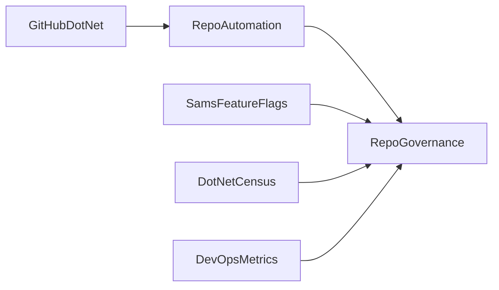

# RepoGovernance

**RepoGovernance is a project I'm building to monitor my side-projects and ensure they are following best practices**. I currently track a number of properties, including repo settings, branch policies, actions, dependabot, auto-versioning, technical debt identification, and DevOps metrics. It uses a number of building blocks/dependencies I've built in the past to achieve this:

- [GitHubDotNet](https://github.com/samsmithnz/GitHubActionsDotNet): Models to generate Actions and Dependabot files with .NET
- [RepoAutomation](https://github.com/samsmithnz/RepoAutomation): To automate the creation of repos with my preferred repo settings, and other GitHub related API calls
- [SamsFeatureFlags](https://github.com/samsmithnz/SamsFeatureFlags): To use Feature Flags/Toggles on my projects
- [DotNetCensus](https://github.com/samsmithnz/DotNetCensus): To identify what version of .NET my projects are using
- [DevOpsMetrics](https://github.com/samsmithnz/DevOpsMetrics): to calculate DORA/DevOps Metrics on my projects

This is how the dependencies look in a graph:

## Current solution
Currently hosted at https://repogovernance-prod-eu-web.azurewebsites.net/. This shows current projects I have configured, with recommendations, pull requests, latest build info, code coverage, SonarCloud warnings, latest release and version information, languages detected, .NET frameworks detected, and current DORA DevOps metrics

## The future?
- Remediation: allowing users to not just identify an issue, but to resolve it with a few clicks. 
- A GitHubApp: so that it's easy for anyone to setup, configure, and use - as well as adding authenication!
- More configuration and settings
